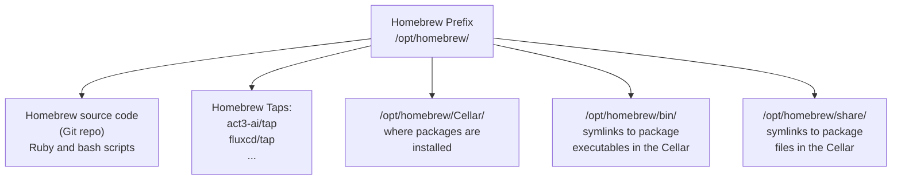
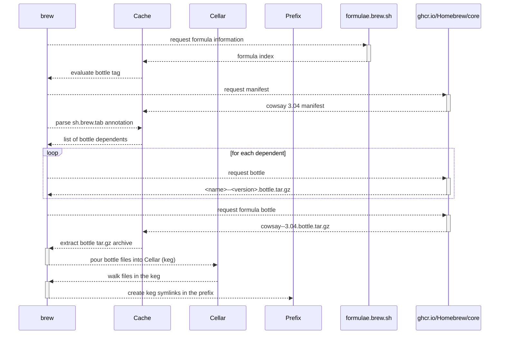

# Homebrew Architecture

---

## Installing Homebrew

Homebrew is installed with a script that does the following:

- Creates the Homebrew "prefix" directory
  - macOS ARM: `/opt/homebrew/`
  - macOS x86: `/usr/local/`
  - Linux x86: `/home/linuxbrew/.linuxbrew`
- Clones the [Homebrew/brew](https://github.com/Homebrew/brew) repository to the prefix
- Checks for a system installation of Ruby
  - If system Ruby is missing, out-of-date, or incompatible, a version of Ruby is installed for use by Homebrew
- Prompts the user to add the Homebrew shell hook to their shell profile script

---

## Homebrew's Prefix

Homebrew installs all packages under the "Homebrew prefix" directory.

---

## Running Homebrew

When a shell is opened, the shell profile script is executed (ex. `~/.bashrc` for Bash, `~/.zshrc` for Zsh, etc.). Homebrew requires users to add a command to the profile script, `eval "$(brew shellenv)"`. When the command is executed, the following Homebrew prefix directories are added to system variables:

- `PATH`: `$HOMEBREW_PREFIX/bin` and `$HOMEBREW_PREFIX/sbin` are added to the `PATH` variable that lists directories containing executables
- `MANPATH`: `$HOMEBREW_PREFIX/man` is added to the `MANPATH` variable that lists directories containing manpages
- `INFOPATH`: `$HOMEBREW_PREFIX/share/info` is added to the `INFOPATH` variable that lists directories containing info pages

This setup allows Homebrew to install packages without overwriting system packages in `/usr/bin` and `/usr/local/bin`. Overwriting system packages with a different version can have unintended side effects.

---

## Source Packages vs Binary Packages

Source packages:

- contain source code
- are built from source once downloaded
- *may* support more systems/architectures
  - Build system dependent
  - An extremely challenging problem to solve

Binary packages:

- contain compiled binary files
- do not need require a compilation step after download
- install faster than source packages

Homebrew formulae are both source packages and binary packages. Homebrew "bottles" (or "bottled formulae") are binary packages.

---

## Fixed Releases vs Rolling Releases

- Rolling release: packages are kept up-to-date with the latest available version
- Fixed release: packages are kept at a fixed version for guaranteed compatibility

Homebrew is a "rolling release" package manager, which is the ideal for most use cases.

`apt` on Ubuntu LTS versions is a "fixed release" package manager, which is desirable for servers and infrastructure systems.

---

## Homebrew Formula Architecture

A Homebrew Formula is a Ruby script that lives in a Git repo, known as a Tap.

A Formula Ruby script defines an instance of a class, and must contain at minimum a download URL, version, and install script (Ruby function).

The Homebrew organization maintains a central Tap in the Homebrew/homebrew-core repository, which is the source of truth for all Homebrew packages and the Homebrew API.

---

## Installing a Homebrew Formula (from source)

`brew install <formula> --build-from-source`

1. Download Homebrew API information from `https://formulae.brew.sh`
2. Find requested formula's information
3. Download the formula's Ruby script (from Homebrew/homebrew-core)
4. Run the Formula Ruby script:
   1. Download and install all dependencies
   2. Download the URL listed
   3. Run the install function
5. Link the created files into the prefix

---

## Homebrew Bottle Architecture

- Homebrew bottles are tar.gz binary packages for a Homebrew formula
- The contents of a Homebrew bottle are the output from running a Homebrew Formula's Ruby script
- Homebrew bottles are produced for the Homebrew/homebrew-core Tap by a GitHub Action that runs `brew install`
- The bottles for the Homebrew/homebrew-core Tap are stored in the GitHub Packages OCI registry (ghcr.io)
- Each formula has its own OCI repository, each version of the formula is tagged
  - Tags point to OCI image indexes referencing images for each platform, each with a single layer containing the bottle tar.gz file

---

## Installing a bottled Homebrew Formula

`brew install <formula> --force-bottle`

1. Download Homebrew API information from `https://formulae.brew.sh`
2. Find requested formula's information
3. Download the tagged manifest for the bottle from Homebrew/core OCI registry
4. Parse the `sh.brew.tab` annotation on the manifest to get list of dependencies
5. Download each dependent bottle
6. Download the requested formula's bottle
7. Extract all bottle tar.gz files into the Cellar (called "pouring")
8. Link the created files into the prefix

---

## Installing a bottled Homebrew Formula (cont.)

---

## Language Limitations

Homebrew is written as a combination of Ruby and bash scripts (entrypoint: [`brew` (bash script)](https://github.com/Homebrew/brew/blob/master/bin/brew)).

Ruby is an interpreted language. Interpreted languages (such as Ruby and Python) are much slower than compiled languages (such as C++ and Go).

Concurrency is more challenging in Ruby than other languages. There are many Ruby interpreters ([here's a list of some](https://github.com/planetruby/awesome-rubies)). Since the Homebrew CLI cannot guarantee consistent behavior between different systems' Ruby interpreters, this makes performance optimizations like concurrency even more challenging to implement.

> Example of a concurrent Ruby library that must check its interpreter before creating a thread-safe hash map: [Concurrent::Hash](https://github.com/ruby-concurrency/concurrent-ruby/blob/8b9b0da4a37585ce5eb71516aca55e93bde39115/lib/concurrent-ruby/concurrent/hash.rb)

---

## Other Limitations

Duplicated efforts: downloading the `https://formulae.brew.sh` API data, the bottle manifest (to parse the `sh.brew.tab` annotation) and each dependent bottles' manifests, and finally the bottles themselves, is duplicated work.

> Look for optimizations in this sequence to request the minimum information necessary

Bottle artifacts are not self-describing. Their annotations and content only contain a subset of the information available from the formula API.

> Limits the ability to mirror the bottle registry

Homebrew cannot authenticate to more than one bottle registry at a time, and does not use existing registry credentials on the user's system.

> This limitation required the development of a custom download strategy for the ACT3 Homebrew Tap, which downloads binary packages from the ACT3 GitLab Container Registry using standard registry credentials.
