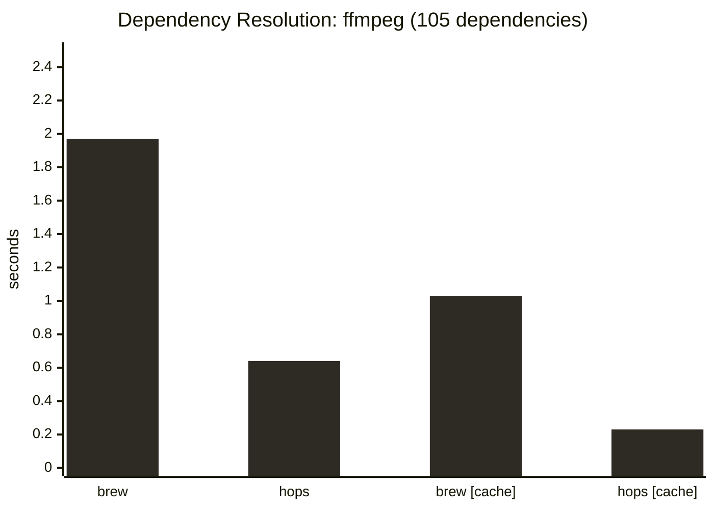
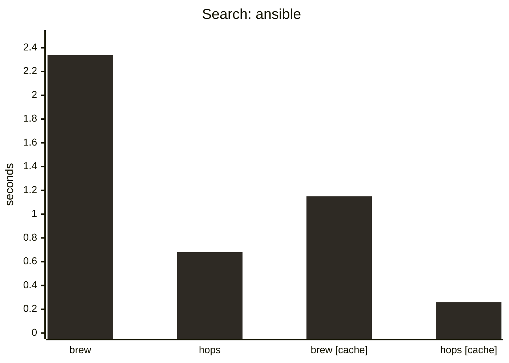
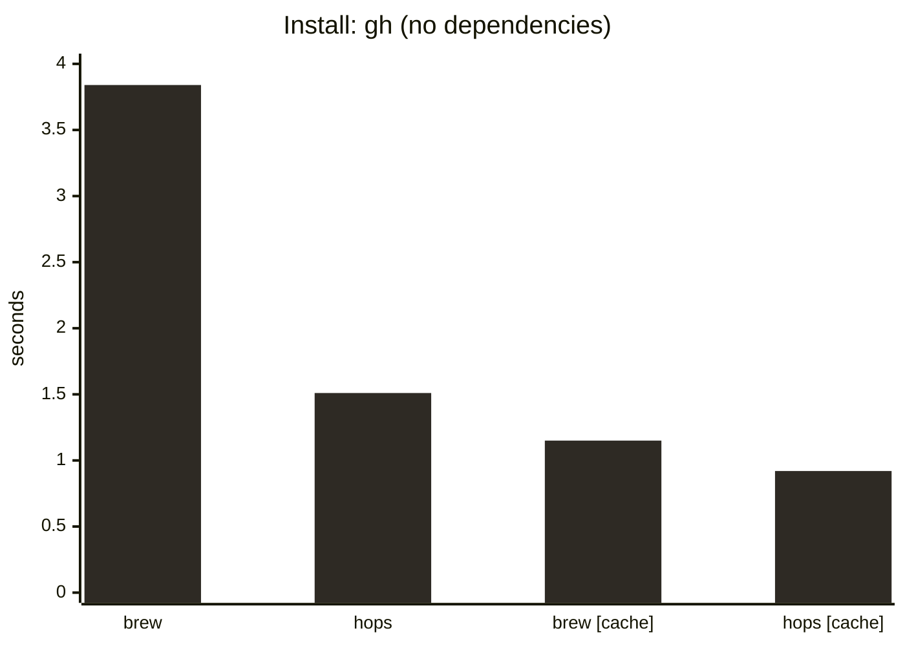
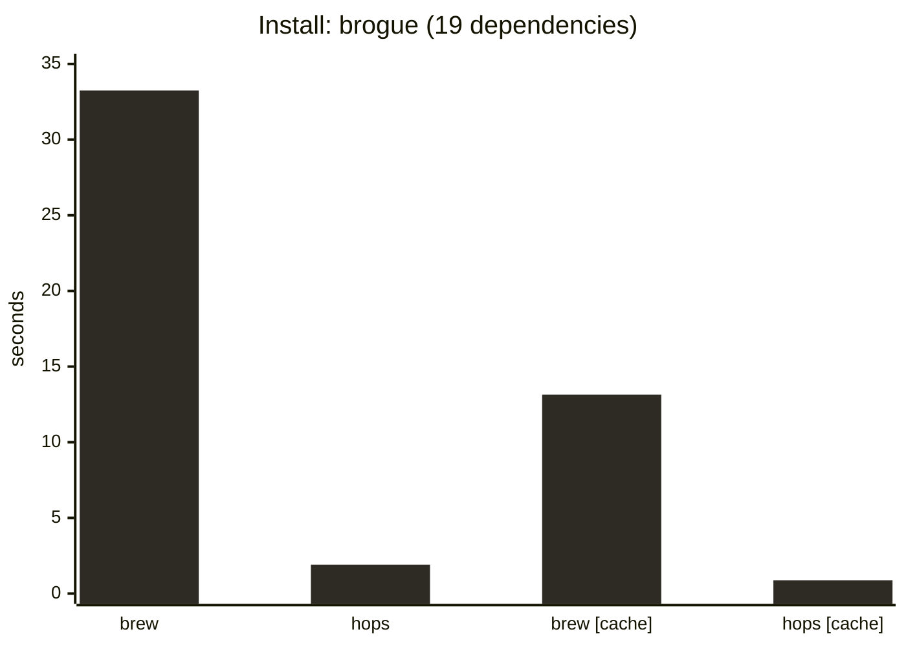

# Hops Design

---

## Hops Goals

The goal of the Hops project is to create a lightweight client for installing, upgrading, and mirroring Homebrew bottles

Goals:

- OCI native
- Follow 12-factor app best practices
- Full compatibility with `ghcr.io/Homebrew/core` registry
- Share Homebrew's local cache
  - Hops will use files cached by Homebrew and vice versa
- Lightweight and performant
- Work independent of Homebrew

---

## Plans

- Minimum functionality for Homebrew independence
  - Install, upgrade, uninstall, search, shell hooks, configuration
- Implement mirroring features
  - List images to mirror
  - Support installing from mirrored Homebrew bottle registry
- Stretch: experiment with Homebrew integrations

---

## Implementation Details

Hops will be written in Go for the following reasons:

- I am already familiar with it
- It has language-level and standard library support for concurrency
- It is a compiled language with better performance than Ruby
<!-- - Only systems languages (such as C++ and Rust) offer consistently better performance -->
- Supports many platforms

The implementation will rely on the following Go packages:

- [ORAS](https://github.com/oras-project/oras-go): OCI artifact transfers
- [sourcegraph/conc](https://github.com/sourcegraph/conc): structured concurrency

---

## Early Benchmarks

Below are early benchmarks comparing equivalent Hops and Homebrew commands. The initial implementations of these commands in Hops will continue to be optimized over time.

> Benchmarks were run on a MacBook Air M1. Hops' concurrency level was set at 8 for all tests.

---

## Benchmark 1

---

## Benchmark 2

---

## Benchmark 3

---

## Benchmark 4

