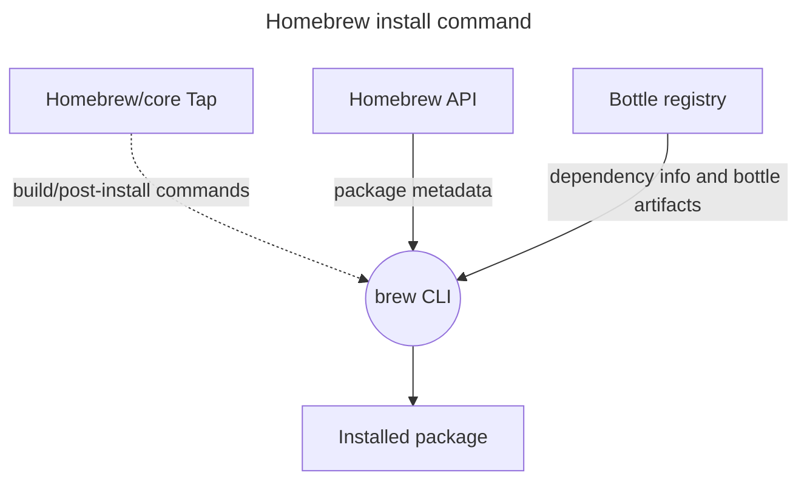
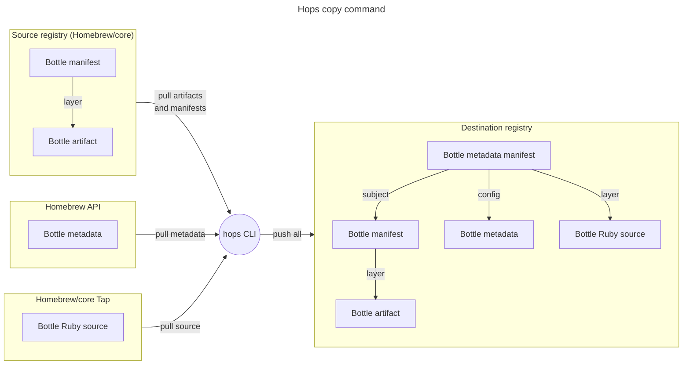
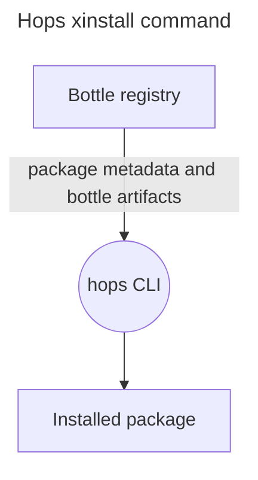
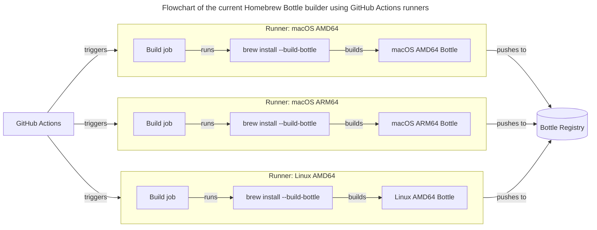
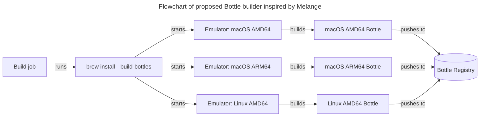

# Hops

- Author: Justen Stall
- Advisors: Dr. Kyle Tarplee, Dr. James Buckley

## Intro

Hops is a Homebrew Bottle installer with a focus on performance and mobility.

## Motivation: Problems with Homebrew

### Mobility

- Multiple sources of truth for package metadata
  - Not mobile for air-gapped environments
- Application is large and relies on system dependencies
  - Not ideal for containerized use

### Performance

- Performance is not up to modern standards
- Locked into Ruby ecosystem

### Security

- Large attack surface
- Security risk from third-party Taps

## Problem: Multiple sources of truth

- [Homebrew/core Tap](https://github.com/homebrew/homebrew-core.git) (Git repository)
  - The ground truth Ruby files, each defining a package (Formula)
- [formulae.brew.sh API](https://formulae.brew.sh) (REST API)
  - JSON data derived from the Homebrew/core Tap
- [Homebrew/core Bottle Registry](https://github.com/orgs/Homebrew/packages?tab=packages&q=core) (OCI Registry)
  - Stores binary package contents

Solutions:

- `hops copy`
- `hops xinstall`

### Solution, part 1: `hops copy`

`hops copy`: Copy Bottles from one registry to another

- Metadata from all sources is pushed to the target registry
- Copied Bottles are ready to be mirrored to an air-gapped environment

<!-- TODO: hops xinstall has been integrated into hops install -->
### Solution, part 2: `hops xinstall`

`hops xinstall`: Install Bottles copied by `hops copy`

- Uses Bottle registry as the single source of truth
- Usable in an air-gapped environment with an OCI Registry
- Simpler network access

## Problem: Large installation

Installing Homebrew requires:

- Homebrew/brew Git repository: 115 MB
- System tools: Git (58.8 MB), Curl (4.2 MB), Ruby (51.4 MB)
- Total: 229.4 MB

### Solution

Hops is a 11 MB statically-compiled binary with embedded manpages and shell completions. (Small enough to send in an email!)

|            | Hops        | Homebrew |
| ---------- | ----------- | -------- |
| Size       | 11 MB       | 229 MB   |
| Files      | 1           | 2304+    |
| Image Size | 12 or 26 MB | 1.63 GB  |

## Problem: Performance

Homebrew cannot optimize for performance because of the compatibility concerns
of Ruby.

### Solution: use the Go language

- Speed: compiled Go programs are only beaten by non garbage-collected languages
  like C/C++/Rust
  - Performance was not a bottleneck
  - Some optimizations made by Homebrew could be skipped
  - Allowed for simpler codebase
- Concurrency: language-level concurrency support
  - Improved performance when downloading packages
- Great package support:
  - [`spf13/cobra`](https://github.com/spf13/cobra) CLI framework for auto-generated help commands, documentation, etc.
  - [`oras-project/oras-go`](https://github.com/oras-project/oras-go) for OCI Registry interaction
  - [`sourcegraph/conc`](https://github.com/sourcegraph/conc) for structured concurrency
- Great developer tooling
  - Built-in benchmarking, CPU/memory profiling, testing
  - Cross-compilation

## Problem: Security concerns

- Packages are defined as Ruby scripts rather than data files (YAML/JSON/TOML/etc)
  - Allows arbitrary code execution and locks Homebrew into the Ruby ecosystem
- Large attack surface

### Solution, part 1: Smaller attack surface

Producing a simpler and smaller application and container image reduces the
attack surface of Hops compared to Homebrew.

#### Image comparison

|             | Hops (distroless) | Hops (full)           | Homebrew     |
| ----------- | ----------------- | --------------------- | ------------ |
| Base image  | chainguard/static | chainguard/wolfi-base | ubuntu:22.04 |
| Size        | 12.1 MB           | 26.4 MB               | 1.63 GB      |
| Files       | 397               | 101                   | 8,907        |
| Executables | 1                 | 28                    | 1,002        |
| Total CVEs  | 0                 | 0                     | 239          |

### Solution, part 2: Pre-built packages only

Because Hops only installs pre-built binary packages (Bottles), it does not
build source packages and does not run the packages' Ruby scripts.

- Hops consumes Homebrew Bottles, but it cannot produce them
- Hops relies on Homebrew to continue producing and publishing Bottles
  - Similar to how [chainguard/melange](https://github.com/chainguard-dev/melange) builds multi-architecture packages that can be installed by the `apk` package manager

### Looking forward: Bottle builder improvements

Take inspiration from `melange`

- Current builder:
  - Runs in a GitHub Action on the Homebrew/core Tap to publish each new package version
  - Unintuitive
  - Does not support multi-architecture builds
    - Requires access to a system for each target platform/architecture
  - I have only found one third-party Tap that produces and publishes Bottles
- Melange:
  - Uses [QEMU emulation](https://www.qemu.org/) for multi-architecture builds
  - Improved package authoring: uses a declarative YAML definition for packages

#### Homebrew Bottle Builder Architecture

#### Melange apk Builder Architecture

## Software Engineering Best Practices

The development of Hops followed Software Engineering Best Practices.

- Continuous Integration/Continuous Deployment (CI/CD):
  - Leveraged GitLab CI/CD for automated builds, tests, and releases
- Testing:
  - Implemented system tests for CLI commands
  - Implemented unit tests for crucial internal functionality
- Benchmarking:
  - Implemented a benchmarking system tracking elapsed time, memory usage, and CPU usage for common CLI commands
  - Monitored benchmarks over time to track performance improvements or regressions
  - Compared benchmarks against the Homebrew CLI to illustrate Hops' improved performance
- Performance profiling:
  - Experimented with CPU and memory profiling to inspect performance bottlenecks
- User experience (UX) design:
  - Options are configurable through flags, environment variables, and a YAML configuration file
